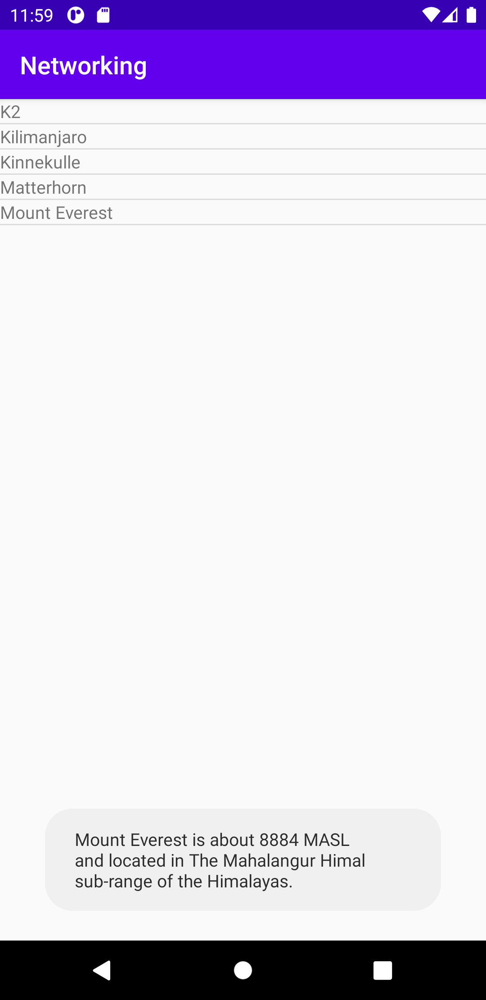
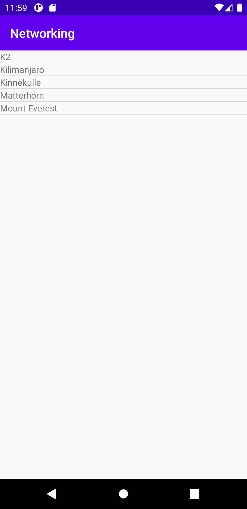

# Rapport för uppgift 6: networking

Till en början skapades lösningen utefter vad som tagits upp under föreläsningen men efter ett tag
ändrades lösningsmetoden då en insåg att många av de delar som tagits upp under genomgången inte
var aktuellt för uppgiften tillhanda.


Från början skapades en ListView, getters, en ny java class och medlemmar till denna och alla dessa tre
användes vidare i den andra lösningsmetoden. Delar som först skapades som inte kom till användning var
exmepelvis gson biblioteket, assets mapp och fil samt WebView. De sistnämnda var relevanta om en velat
hämta datan från en egen .json fil men eftersom en skulle hämta data direkt från en web service kom de
inte till nytta och togs därav bort.


Den aktuella lösningen använde en ListView som fylldes med data genom en TextView där de två kopplades
ihop m.h.a. en adapter. ListView lades i activity_main.xml medan TextView skulle ligga i list_item_textview.xml.
Adaptern initierades i MainActivity.java. Koden nedan skriver ut den hämtade datan ihop med det egenkomponerade
meddelandet i toast:en.
```
adapter = new ArrayAdapter<Mountain>(this, R.layout.list_item_textview,R.id.list_item_textview,item);
ListView myListView = findViewById(R.id.list_view);
        myListView.setAdapter(adapter);
        myListView.setOnItemClickListener(new AdapterView.OnItemClickListener() {
            @Override
            public void onItemClick(AdapterView<?> parent, View view, int position, long id) {
                String name= item.get(position).getName("name");
                int height = item.get(position).getHeight("height");
                String location = item.get(position).getLocation("location");
                String msg = name + " is about " + height + " MASL and located in " + location + ".";
                Toast.makeText(MainActivity.this, msg, Toast.LENGTH_SHORT).show();
            }
        });
```




